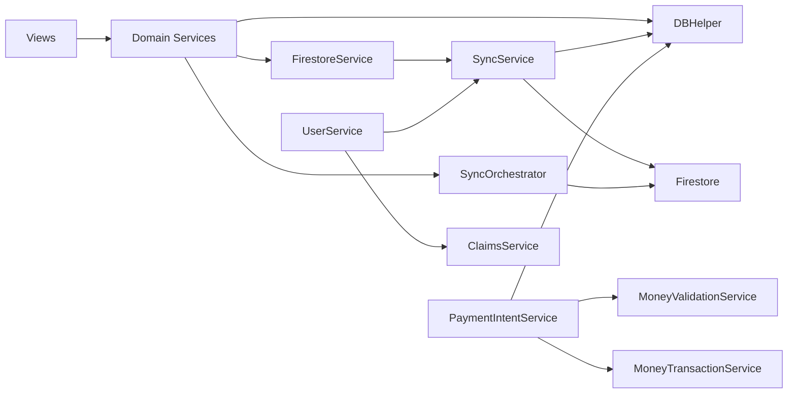

# API_AND_SERVICES

## Nguyên tắc thiết kế service
- Service là lớp bắt buộc cho mọi thao tác nghiệp vụ quan trọng; UI không truy cập Firebase trực tiếp.
- Mỗi service có trách nhiệm rõ: validate dữ liệu, kiểm tra quyền, ghi local/cloud, và phản hồi lỗi thân thiện cho UI.
- Triết lý vận hành: ưu tiên khả năng chạy khi mạng yếu, sau đó mới tối ưu tính tức thời cloud.

## Nhóm service theo trách nhiệm

### 1) Identity, Permission, Tenant
- UserService: xác thực, role, shopId, cache ngữ cảnh shop.
- ClaimsService: đồng bộ custom claims và bảo đảm token role/shop đúng.
- SuperAdminSecurityService: bảo vệ luồng super-admin, PIN/audit.

### 2) Dữ liệu nghiệp vụ
- FirestoreService: trung tâm CRUD cloud theo domain.
- SupplierService, RepairPartnerService, StockEntryService, SalesReturnService...: đóng gói nghiệp vụ theo module.
- DBHelper (qua service): local persistence và migration.

### 3) Sync
- SyncService: cloud -> local realtime/poll, filter theo role + shop.
- SyncOrchestrator: local -> cloud queue, retry, mark trạng thái.
- SyncHealthCheck/SyncAudit: giám sát sức khỏe đồng bộ và truy vết lỗi.

### 4) Payment và Tài chính
- PaymentIntentService: gateway thanh toán tập trung, chống bypass.
- MoneyValidationService: kiểm tra hợp lệ số tiền/luồng thanh toán.
- MoneyTransactionService: ghi nhận transaction tài chính.
- FinancialActivityService: nhật ký hoạt động tài chính.

### 5) Storage, Notification, Integrations
- StorageService/ProductImageService/BackgroundUploadService: quản lý upload ảnh local-cloud.
- NotificationService: in-app + push workflow.
- KiotVietService và nhóm printer services: tích hợp ngoại vi.

## Async flow chuẩn của service
1. Nhận input từ view.
2. Validate và chuẩn hóa model.
3. Ghi local (SQLite) trước khi có thể.
4. Enqueue sync hoặc đẩy cloud ngay tùy ngữ cảnh.
5. Trả trạng thái cho UI (success/error/pending).
6. Phát event refresh qua stream/event bus khi cần.

## Retry, timeout, failure handling
- Retry queue: SyncOrchestrator xử lý retry có giới hạn cho local -> cloud.
- Timeout: các điểm cloud read/write nhạy cảm có timeout để tránh spinner vô hạn.
- Failure fallback:
  - Nếu cloud lỗi nhưng local ghi được: giữ dữ liệu local với cờ pending.
  - Nếu validation lỗi: chặn sớm, không enqueue dữ liệu bẩn.
  - Nếu permission lỗi: trả thông báo rõ nguyên nhân theo vai trò.

## Cache usage
- Cache local chính: SQLite.
- Cache nhẹ: SharedPreferences (cursor, setting, state nhỏ).
- Cache phiên: một số service duy trì in-memory map/list để tăng tốc render.

## Service relationship graph

## Rủi ro tiềm ẩn cần lưu ý khi rebuild
- Coupling giữa service static có thể làm test và refactor khó hơn.
- Drift logic giữa local và cloud nếu thay đổi schema nhưng không cập nhật sync map.
- Timeout/retry cần tuning theo thực tế mạng 3G/4G yếu để tránh false-failure.