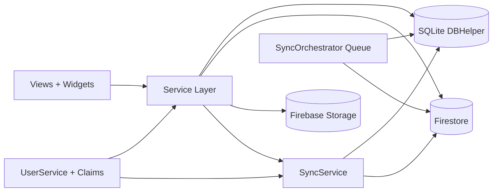

# CORE_ARCHITECTURE

## 1) Tổng thể kiến trúc
- Mô hình thực thi: UI (Views/Widgets) -> Services -> Data layer (SQLite + Firestore).
- Đặc tính chủ đạo: service-first, multi-tenant theo shopId, offline-first với local source-of-truth tức thời và cloud reconciliation.
- Điểm vào app: lib/main.dart với runZonedGuarded, bootstrap Firebase, Notification, Connectivity, AuthGate và đồng bộ theo vai trò.

## 2) Dependency flow
- UI không gọi Firebase trực tiếp; mọi CRUD/đồng bộ đi qua service.
- DBHelper là lớp dữ liệu local trung tâm; nhiều service đọc/ghi local để đảm bảo app hoạt động cả khi mất mạng.
- SyncService + SyncOrchestrator phối hợp hai chiều:
  - Cloud -> Local realtime subscribe/poll.
  - Local -> Cloud queue có retry và đánh dấu trạng thái.

## 3) Service locator / repository pattern
- Dự án hiện tại vận hành theo service singleton/static nhiều hơn DI container đầy đủ.
- Mẫu repository xuất hiện dưới dạng service chuyên miền (FirestoreService, SupplierService, StockEntryService...), mỗi service bao gói truy cập nguồn dữ liệu.
- Ưu điểm: tốc độ phát triển nhanh, dễ truy cập logic nghiệp vụ.
- Nhược điểm: khó test unit độc lập nếu không có abstraction interface rõ ràng.

## 4) State management
- Chủ đạo: StatefulWidget + setState + stream/broadcast cục bộ (EventBus, stream controller trong sync/payment).
- Hệ quả UX: phản hồi nhanh và trực tiếp, nhưng cần kỷ luật để tránh race state khi nhiều nguồn cập nhật đồng thời.

## 5) Realtime sync & offline-first
- Realtime: SyncService subscribe nhiều collection, filter theo shopId và quyền.
- Offline-first: SQLite chứa dữ liệu vận hành, ghi local trước với isSynced=0 rồi enqueue đồng bộ.
- Conflict rule quan trọng: local chưa sync được ưu tiên giữ; cloud update có thể bị skip để tránh mất thao tác tại quầy.

## 6) Flavor online/offline
- Repo đang có lộ trình tách flavor online/offline trong docs chiến lược.
- DNA hiện tại vẫn là bản hybrid: có cloud khi online, vẫn vận hành local khi mất mạng tạm thời.

## 7) Data movement
1. User thao tác tại view -> service validate.
2. Service ghi DBHelper local (đánh dấu sync state).
3. SyncOrchestrator push cloud khi có mạng.
4. SyncService nhận cloud changes -> upsert local + emit event refresh UI.

## 8) Async flow
- Async dày đặc ở thao tác tạo/sửa đơn, nhập kho, thanh toán, đồng bộ ảnh.
- Pattern thường gặp: optimistic local update + background upload/sync + snackbar phản hồi.

## 9) Init/startup flow
1. WidgetsFlutterBinding.ensureInitialized.
2. Firebase.initializeApp (khác biệt iOS/Android với deferred init).
3. Init Notification/Connectivity.
4. AuthGate xác định user, role, shop.
5. SyncService khởi động subscriptions theo quyền hiện tại.

## 10) Navigation architecture
- Chủ yếu dùng Navigator.push + MaterialPageRoute.
- HomeView đóng vai trò router nghiệp vụ theo shortcut và dashboard card.
- Dialog/bottom sheet được dùng như navigation nội tuyến để giảm context switch.

## 11) Caching strategy
- Local cache: SQLite + shared preferences (cursor sync, cấu hình nhẹ).
- Sync cursor theo collection giúp giảm full-fetch lặp lại.
- Payment/cache nghiệp vụ có in-memory cache theo phiên để tăng tốc UI.

## 12) Error handling strategy
- Tầng app: runZonedGuarded bắt lỗi toàn cục.
- Tầng service: try/catch + logging + fallback local/cache khi phù hợp.
- Tầng UX: thông báo tiếng Việt, hành động retry rõ ràng.

## 13) Ưu điểm và nhược điểm
### Ưu điểm
- Tối ưu cho cửa hàng thực: thao tác nhanh, vẫn chạy khi mạng chập chờn.
- Data sync có tenant/permission guard và cơ chế soft delete.
- Chia service theo domain rõ, dễ mở rộng module.

### Nhược điểm
- Coupling giữa nhiều service static làm tăng độ khó khi refactor lớn.
- Navigator phân tán ở nhiều view khiến route map khó tập trung.
- Một số flow phụ thuộc logic ngầm theo role/shop cache cần kiểm thử hồi quy kỹ.

## 14) Mermaid dependency graph

