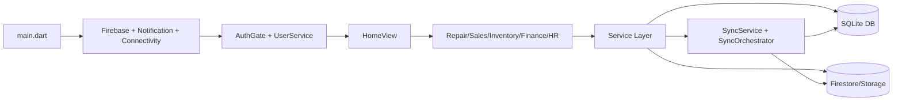
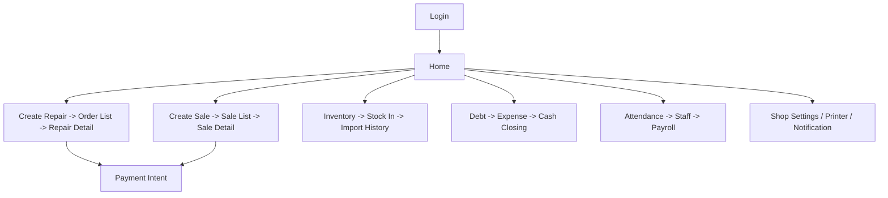
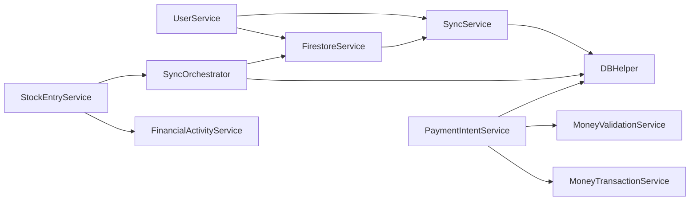

# README_FINAL

## 1) Tổng kết blueprint
Blueprint đã được xây theo mục tiêu tái tạo DNA ứng dụng, không dừng ở mô tả code:
- Kiến trúc tổng thể, data flow, async flow, startup flow.
- Logic nghiệp vụ thực tế cho sửa chữa, bán hàng, kho, công nợ, nhân sự.
- Thiết kế UI/UX gồm màu sắc, typography, spacing, hành vi tương tác.
- Hành vi offline/online, đồng bộ hai chiều, conflict handling.
- Tài liệu màn hình riêng cho toàn bộ view hiện có.

## 2) Mức độ hoàn thiện
- Kiến trúc: rất cao.
- Nghiệp vụ: cao.
- Dữ liệu và đồng bộ: rất cao.
- UI/UX DNA: cao.
- Mức bao phủ màn hình: 112/112 view files.

## 3) Những phần còn thiếu
- Một số micro-interaction chỉ quan sát rõ khi chạy app thực tế trên thiết bị thật.
- Một số flow expansion (đa ngành) cần thêm dữ liệu usage thật để tối ưu ưu tiên rebuild.
- Ma trận printer và tích hợp ngoại vi cần test thực địa để chốt behavior cuối.

## 4) Rủi ro kiến trúc
- Coupling cao ở service static làm tăng chi phí refactor.
- Điều hướng phân tán trong nhiều màn hình, dễ phát sinh lệch flow nếu không duy trì flow map.
- Rule conflict local-unsynced cần regression test chặt khi thay đổi sync hoặc schema.

## 5) Khả năng rebuild từ blueprint
- Đánh giá: khả thi cao.
- Điều kiện thành công:
  1. Giữ nguyên thứ tự triển khai trong APP_REBUILD_GUIDE.
  2. Giữ triết lý offline-first + queue sync.
  3. Giữ visual language xanh thương hiệu + phản hồi nhanh.
  4. Giữ chặt payment pipeline và debt/financial reconciliation.

## 6) Graphs bắt buộc

### Dependency graph

### Screen relationship graph

### Service relationship graph

## 7) Kết luận
Bộ blueprint hiện tại đủ mạnh để một AI khác dựng lại ứng dụng với mức tương đồng cao về kiến trúc, logic nghiệp vụ, flow thao tác và cảm giác sử dụng. Phần khác biệt còn lại chủ yếu nằm ở tinh chỉnh runtime/micro-interaction trên thiết bị thật.