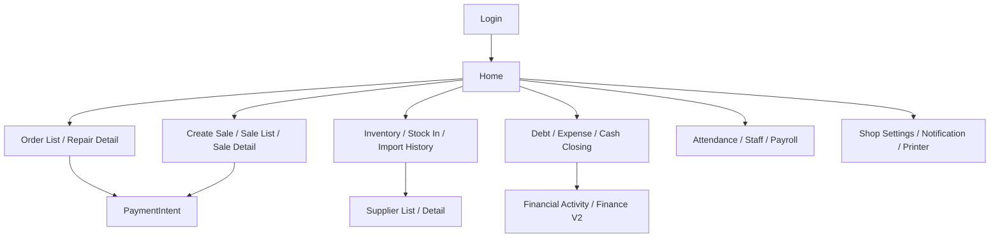

# USER_FLOW_MAP

## Primary flows
1. Login -> Home -> Order List -> Repair Detail -> Payment -> Print -> Complete.
2. Login -> Home -> Create Sale -> Sale Detail -> Invoice Preview -> Print.
3. Login -> Home -> Smart/Fast Stock In -> Pending Stock -> Import History.

## Secondary flows
1. Home -> Customer Management -> Customer Profile -> Sale/Repair History.
2. Home -> Supplier List -> Supplier Detail -> Payment/Import history.
3. Home -> Attendance -> Shift Swap -> Payroll.

## Admin flows
1. Home -> Staff List -> Permissions -> Audit Log.
2. Home -> Shop Settings -> Notification/Printer/Invoice Template.
3. Super Admin -> Shop Selector -> Super Admin Console.

## Offline flows
1. Tạo/sửa đơn khi offline -> ghi local isSynced=0 -> hiển thị pending sync.
2. Ảnh local lưu trước -> upload background khi online.
3. Khi reconnect -> SyncOrchestrator flush queue + SyncService refresh cloud.

## Sync flows
1. Local write -> queue enqueue -> retry -> mark synced.
2. Cloud realtime -> local upsert/delete mềm -> event bus refresh view.
3. Conflict: local unsynced thắng cloud update để bảo toàn thao tác tại quầy.

## Screen relationship graph

